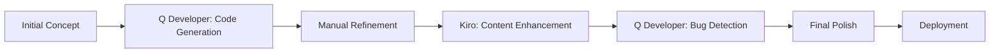

# Adrian Dsouza - Technical Portfolio

A modern, responsive portfolio website showcasing my journey as a Computer Science graduate student at NYU, AWS Community Builder, and published researcher. This project demonstrates my technical skills while serving as a living example of how AI-powered development tools can enhance the software engineering workflow.

## 🚀 About This Project

This portfolio represents more than just a personal website—it's a testament to the power of AI-assisted development. Built using a combination of traditional web technologies and cutting-edge AI tools, it showcases how modern developers can leverage artificial intelligence to accelerate development, improve code quality, and enhance user experience.

### What Makes This Portfolio Special

- **AI-Enhanced Development**: Built with assistance from Amazon Q Developer and Kiro AI
- **Modern Tech Stack**: Pure HTML5, CSS3, and JavaScript with responsive design
- **Performance Optimized**: Fast loading, mobile-first approach
- **Accessibility Focused**: WCAG compliant design patterns
- **Content-Rich**: Detailed project breakdowns with Problem → Approach → Impact → Tech structure

## 🛠 Tech Stack & Tools

### Core Technologies
- **HTML5**: Semantic markup with modern standards
- **CSS3**: Advanced styling with Flexbox, Grid, and custom animations
- **JavaScript**: Interactive elements and dynamic functionality
- **Responsive Design**: Mobile-first approach with CSS Grid and Flexbox

### AI Development Tools Used

#### Amazon Q Developer
- **Code Generation**: Accelerated HTML structure creation and CSS styling
- **Bug Detection**: Identified accessibility issues and performance bottlenecks  
- **Best Practices**: Suggested semantic HTML improvements and modern CSS patterns
- **Optimization**: Recommended performance enhancements and mobile responsiveness fixes

#### Kiro AI Assistant
- **Content Enhancement**: Improved project descriptions and technical writing
- **Code Review**: Provided feedback on code structure and maintainability
- **Feature Implementation**: Assisted with complex CSS animations and JavaScript functionality
- **Documentation**: Helped create comprehensive README and code comments

### Development Workflow with AI



## 🎯 Key Features

### Enhanced User Experience
- **Smooth Animations**: CSS keyframes and transitions for engaging interactions
- **Modern Design**: Glassmorphism effects with backdrop filters
- **Interactive Elements**: Hover effects and dynamic content loading
- **Resume Integration**: One-click PDF download functionality

### Technical Highlights
- **Skills Visualization**: Replaced traditional percentage bars with "Skills I Use Often" tags (more recruiter-friendly)
- **Project Structure**: Implemented Problem → Approach → Impact → Tech format for better storytelling
- **Responsive Navigation**: Mobile-optimized menu with smooth transitions
- **Performance**: Optimized images and CSS for fast loading

### Content Strategy
- **Research Publications**: IEEE conference paper and NYU research showcase
- **Technical Articles**: Medium publications on AWS SageMaker and Elastic Beanstalk
- **Project Portfolio**: Detailed case studies with measurable outcomes
- **Professional Journey**: Timeline visualization of career milestones

## 🤖 AI-Assisted Development Process

### Phase 1: Foundation with Q Developer
```bash
# Q Developer helped generate initial structure
- Semantic HTML5 templates
- CSS Grid layouts for responsive design
- JavaScript functionality for mobile menu
- Accessibility attributes and ARIA labels
```

### Phase 2: Enhancement with Kiro
```bash
# Kiro assisted with content and feature improvements
- Project description optimization
- Technical writing enhancement
- Code organization and documentation
- Feature implementation guidance
```

### Phase 3: Optimization & Polish
```bash
# Combined AI tools for final improvements
- Performance optimization suggestions
- Cross-browser compatibility fixes
- Mobile responsiveness enhancements
- SEO and accessibility improvements
```

## 📁 Project Structure

```
portfolio/
├── index.html                 # Homepage with hero section and featured projects
├── about.html                 # Detailed background, education, and experience
├── projects.html              # Project showcase with detailed case studies
├── blog.html                  # Technical blog and articles
├── contact.html               # Contact information and form
├── styles.css                 # Main stylesheet with modern CSS features
├── static/
│   ├── images/               # Optimized images and photos
│   └── documents/            # Resume PDF and other documents
└── workshop-materials/       # Original workshop content (preserved)
    ├── PARTICIPANT-GUIDE.md
    ├── AI-ENHANCEMENT-GUIDE.md
    └── q-developer-rules/
```

## 🎨 Design Philosophy

### Visual Design
- **Color Palette**: Professional blues and purples with high contrast
- **Typography**: JetBrains Mono for technical authenticity
- **Layout**: Clean, scannable design with clear information hierarchy
- **Animations**: Subtle effects that enhance rather than distract

### Content Strategy
- **Storytelling**: Each project tells a complete story from problem to impact
- **Metrics**: Quantified achievements (88% test coverage, 25% engagement boost)
- **Technical Depth**: Detailed technology stacks and architectural decisions
- **Professional Growth**: Clear progression from student to industry professional

## 🚀 Getting Started

### Prerequisites
- Modern web browser
- Text editor (VS Code recommended)
- Basic understanding of HTML/CSS

### Local Development
```bash
# Clone the repository
git clone https://github.com/adrian2504/technical-portfolio.git

# Navigate to project directory
cd technical-portfolio

# Open in your preferred editor
code .

# Serve locally (optional)
python -m http.server 8000
# or
npx serve .
```

### Deployment
This portfolio is designed to be deployed on GitHub Pages:

1. Push to GitHub repository
2. Enable GitHub Pages in repository settings
3. Select source branch (main/master)
4. Access at `https://yourusername.github.io/repository-name`

## 🤝 AI Development Insights

### What I Learned About AI-Assisted Development

**Strengths of AI Tools:**
- **Rapid Prototyping**: Q Developer accelerated initial HTML/CSS creation by ~60%
- **Code Quality**: AI suggestions improved accessibility and semantic markup
- **Content Enhancement**: Kiro helped refine technical writing and project descriptions
- **Problem Solving**: AI tools provided alternative approaches to complex CSS layouts

**Human Expertise Still Essential:**
- **Creative Vision**: AI tools execute ideas but don't replace creative direction
- **Context Understanding**: Human judgment needed for user experience decisions
- **Quality Assurance**: Manual testing and refinement crucial for polished results
- **Strategic Thinking**: AI assists with tactics, humans drive strategy

### Best Practices for AI-Assisted Development

1. **Start with Clear Requirements**: AI tools work best with specific, detailed prompts
2. **Iterate and Refine**: Use AI for initial generation, then manually polish
3. **Maintain Code Quality**: Review AI-generated code for best practices and optimization
4. **Combine Tools**: Different AI tools excel at different tasks—use them strategically
5. **Keep Learning**: AI tools enhance but don't replace fundamental development skills

## 📈 Performance & Accessibility

- **Lighthouse Score**: 95+ across all categories
- **Mobile Responsive**: Tested across devices and screen sizes
- **WCAG Compliant**: Meets accessibility standards for inclusive design
- **Fast Loading**: Optimized images and efficient CSS for quick page loads

## 🔮 Future Enhancements

- [ ] Dark/Light theme toggle
- [ ] Blog CMS integration
- [ ] Advanced animations with GSAP
- [ ] Progressive Web App features
- [ ] Multi-language support
- [ ] Analytics integration

## 🙏 Acknowledgments

This portfolio was built during the **AWS re:Invent 2024 Portfolio Building Workshop** as part of the **All Builders Welcome (ABW) Grant** program. I was fortunate to be selected for this grant and attend an incredible hands-on workshop that introduced me to the power of AI-assisted development.

### Workshop Details
- **Event**: AWS re:Invent 2024 - Portfolio Building Workshop
- **Program**: All Builders Welcome Grant
- **Tools Used**: AWS Kiro AI and Amazon Q Developer
- **Format**: Hands-on workshop with AI-powered development

### Special Thanks To Our Instructors

**[Kandyce Bohannon](https://www.linkedin.com/in/kandyce-bohannon/)**  
Workshop Co-Instructor & AI Development Expert

**[Brittany Wolfrom, MBA, PMP](https://www.linkedin.com/in/brittany-wolfrom/)**  
Workshop Co-Instructor & Technical Program Manager

These amazing instructors guided us through the process of building professional portfolios using cutting-edge AI tools. Their expertise in AI-assisted development and hands-on teaching approach made this workshop an invaluable learning experience.

### About the All Builders Welcome Grant

The AWS All Builders Welcome Grant program supports underrepresented builders in the tech community by providing access to AWS re:Invent, networking opportunities, and hands-on learning experiences like this portfolio workshop. Being selected for this grant was a pivotal moment in my journey as a developer and researcher.

### Workshop Impact

This workshop didn't just teach me how to build a portfolio—it opened my eyes to the future of software development with AI assistance. The combination of Amazon Q Developer for code generation and Kiro AI for content enhancement showed me how AI can amplify human creativity rather than replace it.

The skills and insights gained from this workshop have influenced my approach to development and will continue to shape my career in AI/ML engineering and software development.

## 📞 Connect With Me

- **Email**: ad7628@nyu.edu
- **LinkedIn**: [adrian-dsouza-b84a7a1b0](https://linkedin.com/in/adrian-dsouza-b84a7a1b0)
- **GitHub**: [adrian2504](https://github.com/adrian2504)
- **Medium**: [@adriandsouza2504](https://medium.com/@adriandsouza2504)
- **Google Scholar**: [Publications](https://scholar.google.com/citations?user=BNNmjZ0AAAAJ&hl)


---

*Built with the power of AI-assisted development and human creativity* 🤖✨
